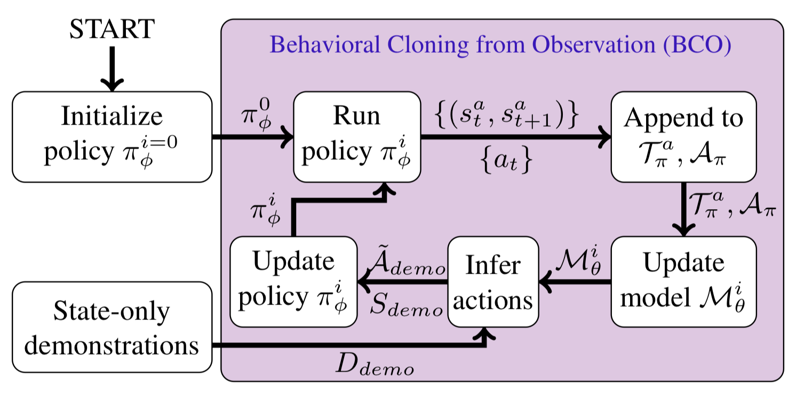

# [IJCAI'18] Behavioral Cloning from Observation
An UNOFFICIAL **PyTorch** implementation of [BCO](https://www.ijcai.org/proceedings/2018/0687.pdf)



## Requirements
This code is implemented under Python3 and [PyTorch](https://pytorch.org/).
<br> Following libraries are also required:
+ [gym](https://gym.openai.com/)
+ [MuJoCo](http://www.mujoco.org/)

## Usage
+ Discrete action (CartPole, trained by DQN)
```
model_bco-discrete.ipynb
```

+ Continuous action (Reacher, trained by PPO)
```
model_bco-continuous.ipynb
```

## Citation
```
@inproceedings{torabi2018bco,
  author = {Faraz Torabi and Garrett Warnell and Peter Stone}, 
  title = {Behavioral Cloning from Observation}, 
  booktitle = {International Joint Conference on Artificial Intelligence (IJCAI)}, 
  year = {2018} 
}
```

## Acknowledgement
+ [OpenAI Baselines](https://github.com/openai/baselines)
+ [pytorch_a2c-ppo-acktr](https://github.com/ikostrikov/pytorch-a2c-ppo-acktr)
+ [Behavioral Cloning from Observation](https://www.ijcai.org/proceedings/2018/0687.pdf)
